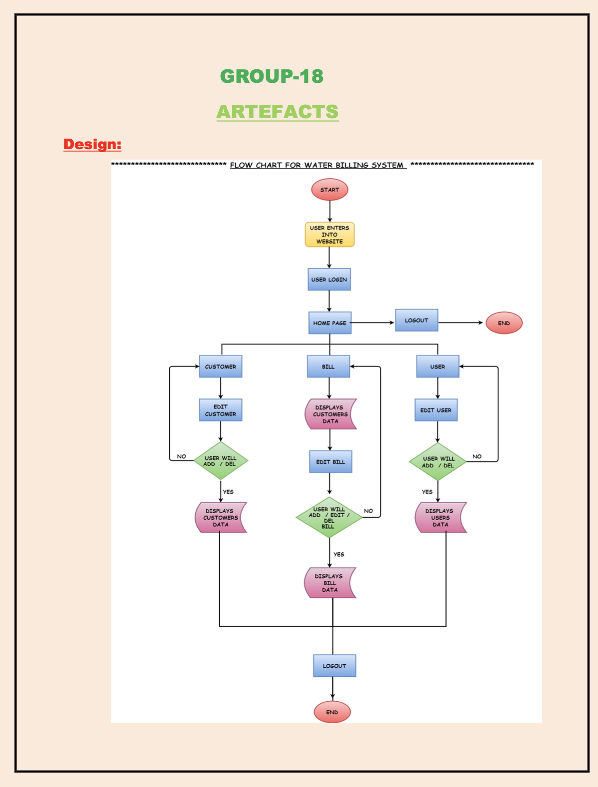
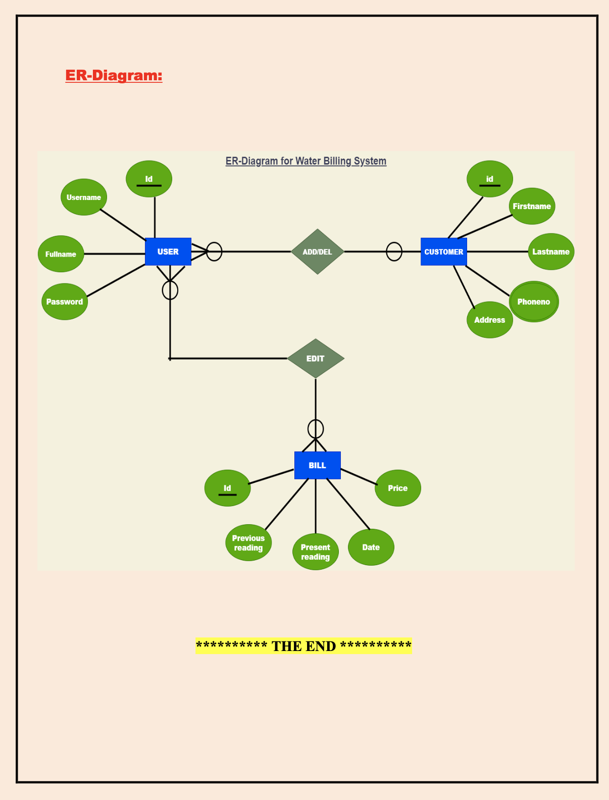
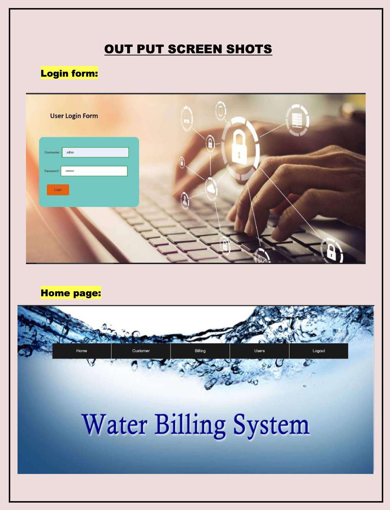
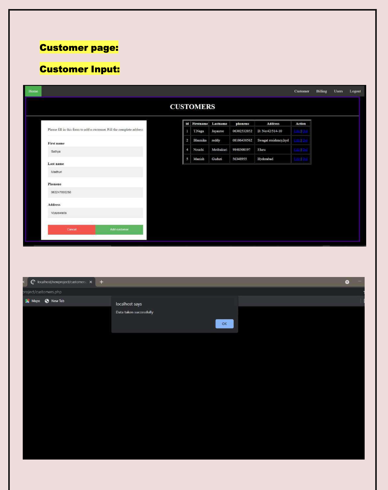
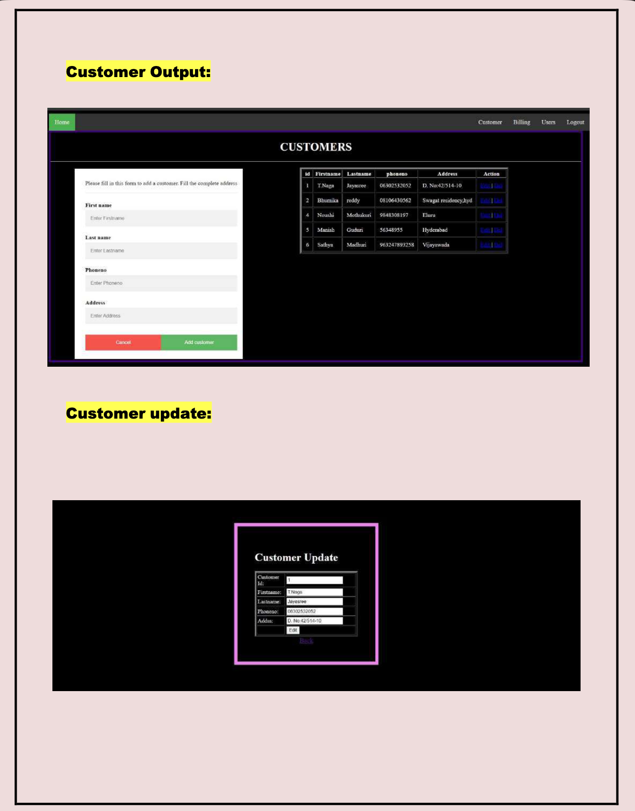
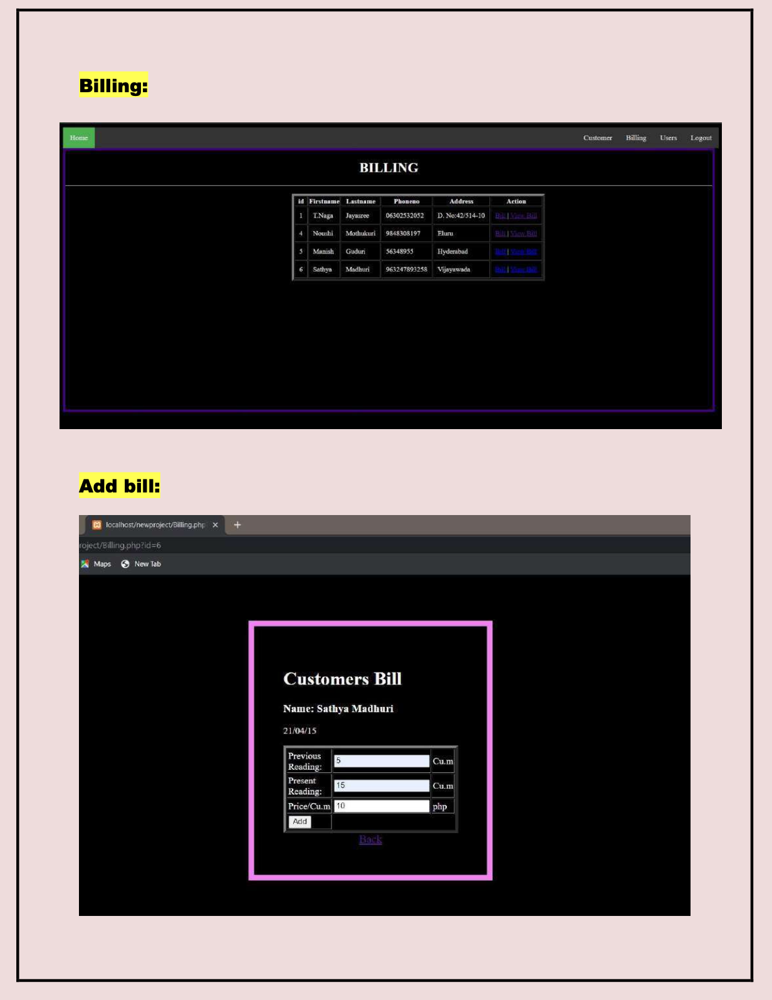
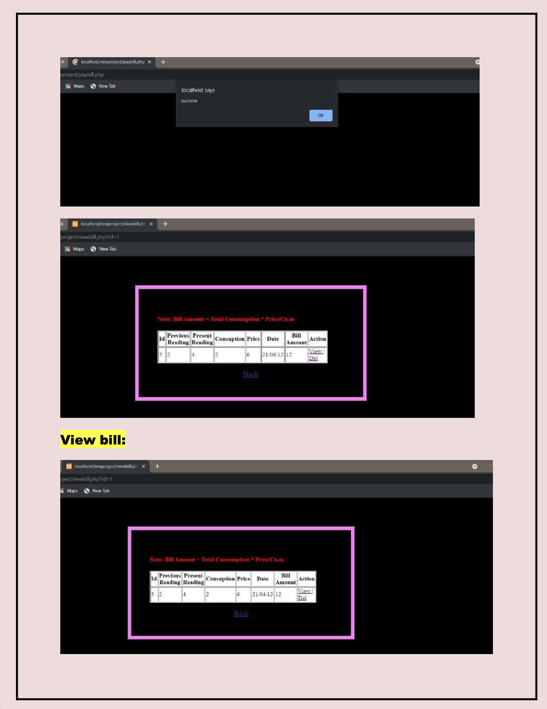
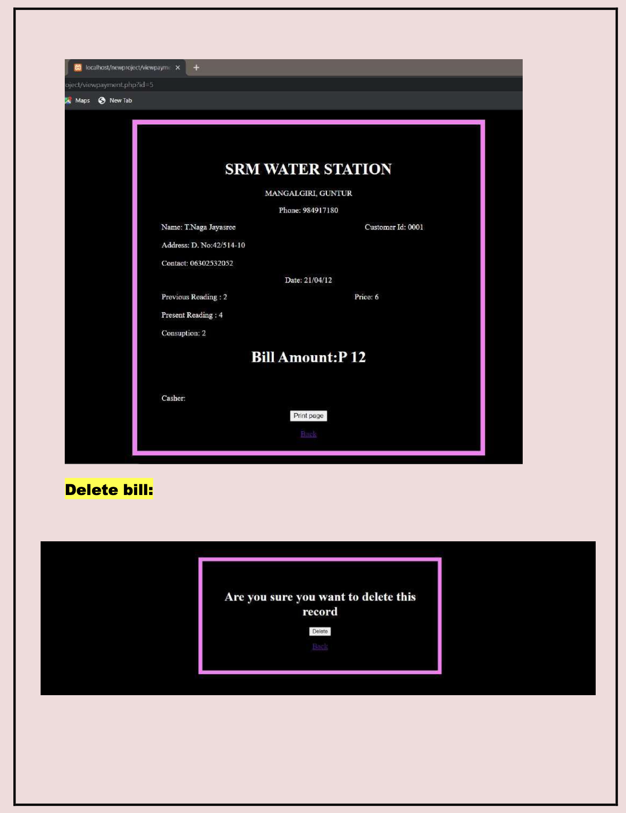

# Water Billing System (DBMS Web App)

Built a DBMS-backed web application to manage customers, users, and monthly water bills with automated bill calculation.

## Objective
Automatically calculate customer bills using previous meter reading, current meter reading, and price per unit, and maintain bill history.

## Features
- User login (authorized users only)
- Customer management (add/edit/delete)
- Billing management (create bill, view/print bill history)
- User management (add/edit/delete users)

## System Design
- Workflow: login → customer/user/billing modules → bill history → logout
- Database: User, Customer, Bill tables (relational)

## Tech Stack
HTML, CSS, JavaScript, PHP, MySQL (VS Code + XAMPP / localhost)

## Key Visuals

### UI Screens

### Customer Module (CRUD)

### Billing Module

## Docs
- Project synopsis: docs/dbms_project_synopsis.pdf
- Design artefacts: docs/artefacts_flow_er.pdf
- Output screenshots: docs/output_screenshots.pdf

